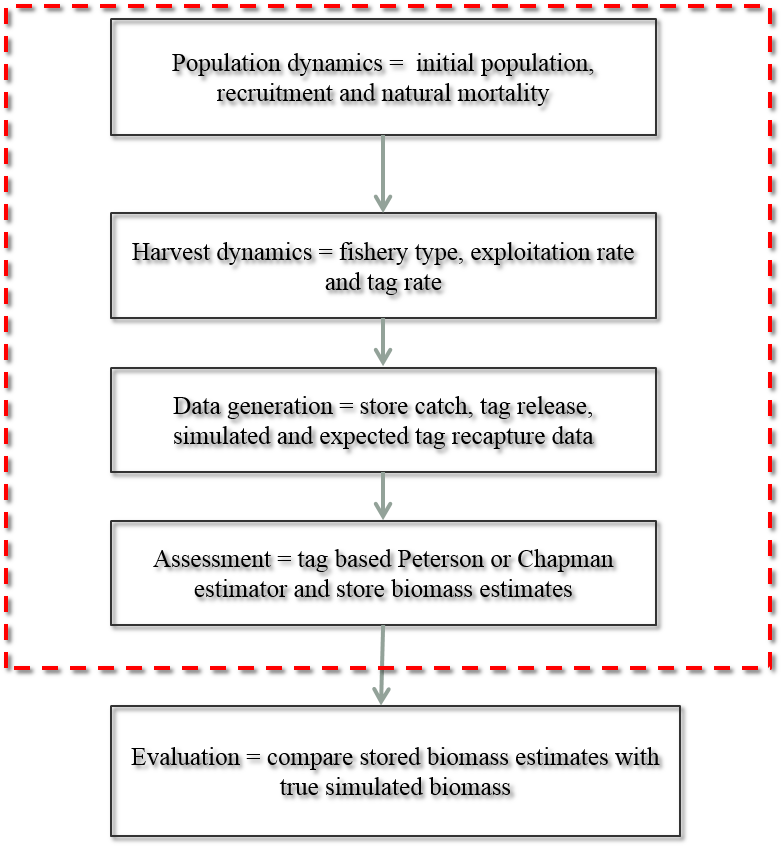

<!-- What is tagsim? -->

The **tagsim** package is a simplified fisheries simulation model that was 
developed to evaluate spatial bias in Petersen mark recapture population
estimates. The model simulates a population with no age or size structure and
hence no requirement for fishing selectivity. Essentially, the model
considers tagged and untagged individual in one or more areas (or regions).

<!-- What does it do? -->

The model is used to used to simulate and an exploited fish populations and 
contains the following components: population dynamics, harvest dynamics, data
generation and assessment (see Figure below). 

 

While the model is designed to evaluate the effects of spatial biases tag-based
assessments is it also possible to evaluate single-area scenarios and scenarios
without tagging data.

# tagsim 

Load the **tagsim** package

```{r}
library(tagsim)
```

Help files can be accessed using

```{r, eval=FALSE}
?tagsim
```

# The control file

The parameters of a simulation are specified using a control file which is a list object created using the function **create\_control**. Most of the function arguments require a list to be provided containing the parameters to specify the model. The number of years and regions in the model are an exception and are specified with vectors.

## Population parameters

The inital population size and natural mortality are specified using "initial" and "nat_mort".

## Recruitment parameters

The process to generate recruitment is specified using the "type" argument. Possible types include "constant", "logistic", "bevholt" or "ricker". Recruitment variability is controled using the "stochastic\_rec". 

## Harvest parameters

The harvest parameter "type" specifies the how the catch is calculated. Currently two types are available, a constant exploitation rate ("type" = "const_exploit") and a constant total allowable catch (TAC; "type" = "TAC"). The "rate" parameter controls the magnitude of catch. It should be between zero and one if it's an exploitation rate and the total number of removals for a constant TAC.

## Tagging parameters

Tag based estimates of abundance provide inferences based on the assumption of that the tagged and untagged populations are identical. Important parameters to consider are

* initial tag loss and tag induced mortality, the tag loss and mortality associated with the tagging process. This is specified by the "mort" argument

* chronic (ongoing) tag shedding is specified by "shed" and

* the tag reporting rate, the probability a recaptured tag is reported is specified using the "report" parameter 

## Movement parameters

Movement among is implemented using a transition matrix that can either be specified using one of the functions provided or by the user supplying one.

## Assessment parameters

The **tagsim** package was developed to evaluate spatial biases in tag-based assessments and therefore the focus in on single tag recapture models, however, some additional simplified assessments also provided. Currently the two assessment options are "tag", which undertakes a single region tag based assessment and "survey" which estimates the population
size with a specified level of uncertainty. 

##  Specifying the Model

It can be useful to specify the model parameters separately, they are divided 
into seven groups.

The initial population is defined along with the natural mortality rate

```{r}
pop <- list("initial" = 1e7, "nat_mort" = 0.1)
```

The 'type' recruitment defines how the population grows over time with respect
to other parameters such as the current population size, here we specify a 
constant recruitment. The recruitment is distributed among the regions in a 
uniform manner.

```{r}
rec <- list("type" = "constant", "initial" = 1e6, "mu"=0, "s"=1,
            "spat_dist"="uniform", "stochastic_rec"=TRUE)
```

Harvest parameters are defined

```{r}
harvest <- list("type" = "const_exploit", "rate" = 0.05, "max" = 0.95,
                "ricker"=1)
```

Tagging is specified the release rate ("rel_rate") determines the number of tags
released in relation to the catch. The initial tagging related mortality ("mort")
and the ongoing tag shedding rate ("shed") along with the proportion of 
recaptured tags that are reported ("report").

```{r}
tag <- list("rel_rate" = 0.05, "mort" = 0, "shed" = 0, "report" = 1)
```

How the fishinf effort is allocated

```{r}
fish <- list("type" = "random", "prop" = 0.5)
```

How the fish population move among the areas

```{r}
move <- list("type" = "complete", "prob" = 0.05)
```

The type of assessment is defined.

```{r}
assess <- list("type" = "survey", "cv"=0.2)
```

Create a control file

```{r}
tmp <- create_control(years = 1:5, 
                      regions = 1:10, 
                      pop_pars = pop, 
                      rec_pars = rec,
                      harvest_pars = harvest, 
                      tag_pars = tag, 
                      fish_pars = fish, 
                      move_pars = move, 
                      assess_pars = assess)
```

Examine the structure of the control file, note that most of the parameters remain as lists, however, a movement matrix is created and recruitment specified by area. There are also some additional parameters created that are used to simplify the internal simulation code.

```{r}
str(tmp)
```


# Example

We specify a single region population and fish it for 5 years with 10 different exploitation rates

```{r}
pop <- list("initial" = 1e7, "nat_mort" = 0.1)
rec <- list("type" = "constant", "initial" = 5e5, "mu"=0, "s"=1,
            "spat_dist"="uniform", "stochastic_rec"=TRUE)
tag <- list("rel_rate" = 0.05, "mort" = 0, "shed" = 0, "report" = 1)
fish <- list("type" = "random", "prop" = 1)
move <- list("type" = "complete", "prob" = 0)
assess <- list("type" = "survey", "cv"=0.1)

```

Define the number of simulations, a vector of exploitation rates to do and a matrix to store the results

```{r}
reps <- 500
exploit_rate <- 0.025 * 1:10
res <- matrix(0, reps, length(exploit_rate))
```


A simulation is then run using the **run_sim** function with a loop to repeat the simulation for all of the exploitation rates.

```{r}
for(i in 1:length(exploit_rate)){
  ## update the harvest rate parameters
  harvest <- list("type" = "const_exploit", "rate" = exploit_rate[i], 
                  "max" = 0.95, "ricker"=1)
  ## create the control file
  ctrl <- create_control(years = 1:5, 
                         regions = 1, 
                         pop_pars = pop, 
                         rec_pars = rec,
                         harvest_pars = harvest, 
                         tag_pars = tag, 
                         fish_pars = fish, 
                         move_pars = move, 
                         assess_pars = assess)
  ## run the ith simulation
  obj <- run_sim(ctrl, reps)
  ## save the end of year % unfished biomass
  res[, i] <- obj$true_N[6,] / obj$true_N[1,]
}

```

Calculate the mean over the simulation

```{r}
mns <- colMeans(res)
```

Plot the estimated proportions of unfished biomass for each of the exploitation
rates.

```{r}
plot(mns ~ exploit_rate, las=2, ylim=c(0,1), type="b",
     main="Biomass after 5 years of fishing",
        ylab="Biomass as % unfished", xlab="Exploitation rate")

```

# Session information

This document was created using rmarkdown, knitr and the following R packages

```{r}
sessionInfo()
```
